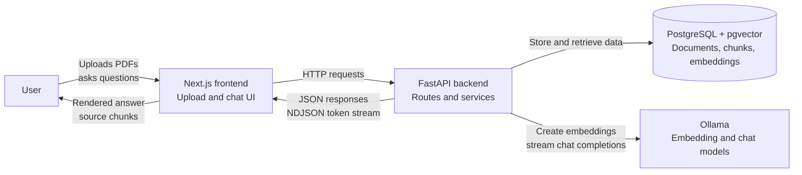
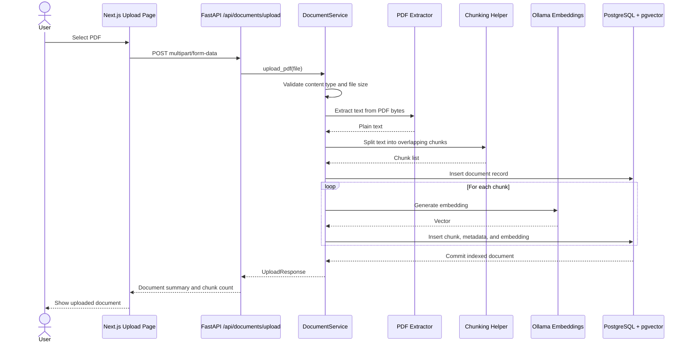
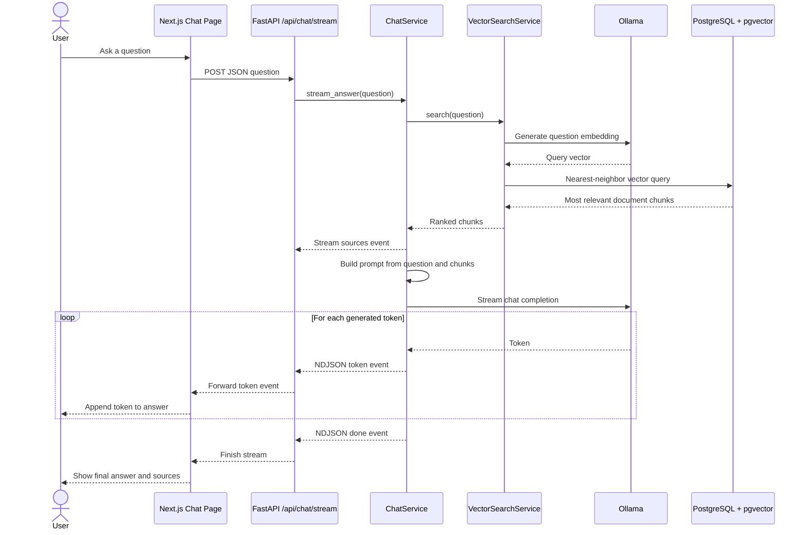
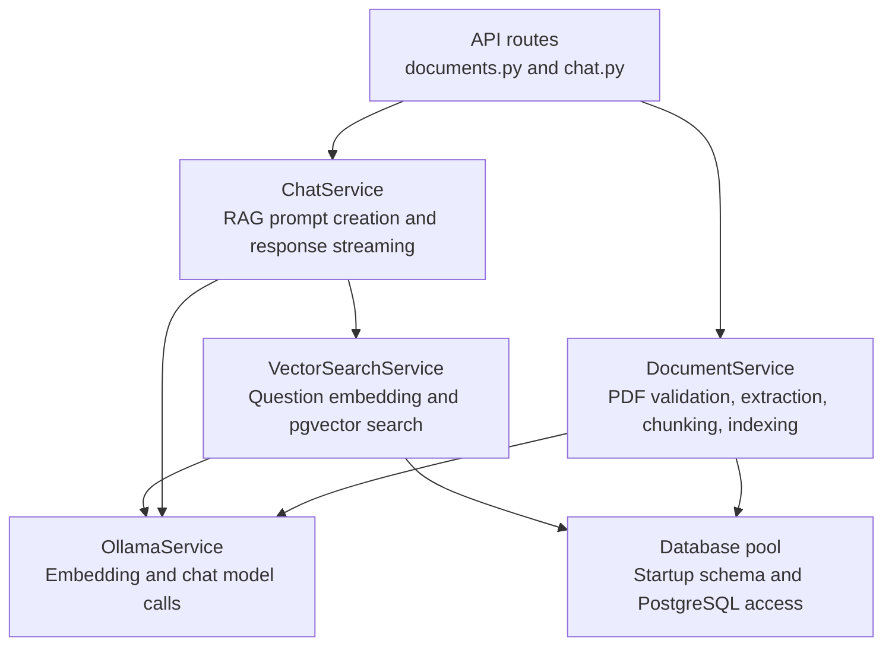

# Project Workflow

This project is a local-first RAG application. Users upload company PDFs, the backend turns those PDFs into searchable vector chunks, and the chat screen streams answers grounded in the uploaded documents.

## System Overview



## Upload And Index Workflow



## Chat Retrieval Workflow



## Backend Service Responsibilities



## Data Flow In Plain English

1. A PDF is uploaded from the frontend.
2. The backend extracts readable text, splits it into overlapping chunks, and asks Ollama for an embedding for each chunk.
3. PostgreSQL stores the document metadata, chunk text, and pgvector embeddings.
4. A user asks a question in the chat UI.
5. The backend embeds the question, searches pgvector for similar chunks, and builds a prompt from those chunks.
6. Ollama streams the answer back through FastAPI as newline-delimited JSON.
7. The frontend renders tokens as they arrive and shows the source chunks used for the answer.

## Whole Project Text Diagram

```txt
COMPANY AI ASSISTANT

User
  |
  | 1. Upload PDF / ask question
  v
Next.js Frontend
  - Upload page
  - Chat page
  - API client
  - Streaming chat hook
  |
  | 2. HTTP request
  |    - POST /api/documents/upload
  |    - GET /api/documents
  |    - DELETE /api/documents/{document_id}
  |    - POST /api/chat/stream
  v
FastAPI Backend
  - documents.py handles upload, list, delete
  - chat.py handles streamed answers
  |
  +-----------------------------+
  |                             |
  | Upload path                 | Chat path
  |                             |
  v                             v
DocumentService               ChatService
  - validate PDF                - receive question
  - extract PDF text            - request relevant chunks
  - split into chunks           - build RAG prompt
  - embed chunks                - stream answer events
  - store document
  |                             |
  v                             v
OllamaService                 VectorSearchService
  - chunk embeddings             - embed question
  |                              - search similar chunks
  v                             |
PostgreSQL + pgvector <---------+
  - documents table
  - document_chunks table
  - vector embeddings
  |
  | Relevant source chunks
  v
ChatService
  |
  | Prompt with retrieved context
  v
OllamaService
  |
  | Stream generated tokens
  v
FastAPI StreamingResponse
  |
  | Newline-delimited JSON events
  | - sources
  | - token
  | - error
  | - done
  v
Next.js Frontend
  |
  | Render answer and source chunks
  v
User
```
